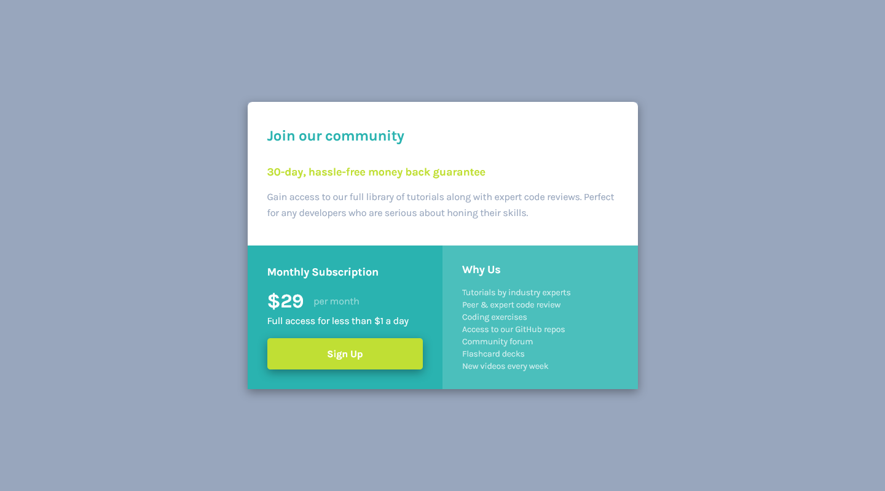

# Frontend Mentor - Single price grid component solution

This is a solution to the [Single price grid component challenge on Frontend Mentor](https://www.frontendmentor.io/challenges/single-price-grid-component-5ce41129d0ff452fec5abbbc). Frontend Mentor challenges help you improve your coding skills by building realistic projects. 

## Table of contents

- [Overview](#overview)
  - [The challenge](#the-challenge)
  - [Screenshot](#screenshot)
  - [Links](#links)
- [My process](#my-process)
  - [Built with](#built-with)
  - [What I learned](#what-i-learned)
- [Author](#author)

## Overview

### The challenge

Users should be able to:

- View the optimal layout for the component depending on their device's screen size
- See a hover state on desktop for the Sign Up call-to-action

### Screenshot

*Desktop preview:* 

*Mobile preview:*

### Links

- Solution URL: [GitHub](https://github.com/GrzywN/single-price-grid-component-master)
- Live Site URL: [Netlify](https://sharp-hamilton-55504e.netlify.app/)

## My process

### Built with

- Semantic HTML5 markup
- SASS/SCSS and its custom properties
- CSS custom properties and transitions
- Flexbox
- CSS Grid
- Figma design file

### What I learned

I've learned how to make my workflow ready for bigger projects by separating SASS files for different parts of project (variables, mixins, styles for parts of website etc.) I know it wasn't optimal to do that in that small project, but I wanted to try something new.

## Author

- GitHub - [GrzywN (Karol Binkowski) · GitHub](https://github.com/GrzywN)
- Frontend Mentor - [@GrzywN](https://www.frontendmentor.io/profile/GrzywN)
- Discord - fansik#2808
